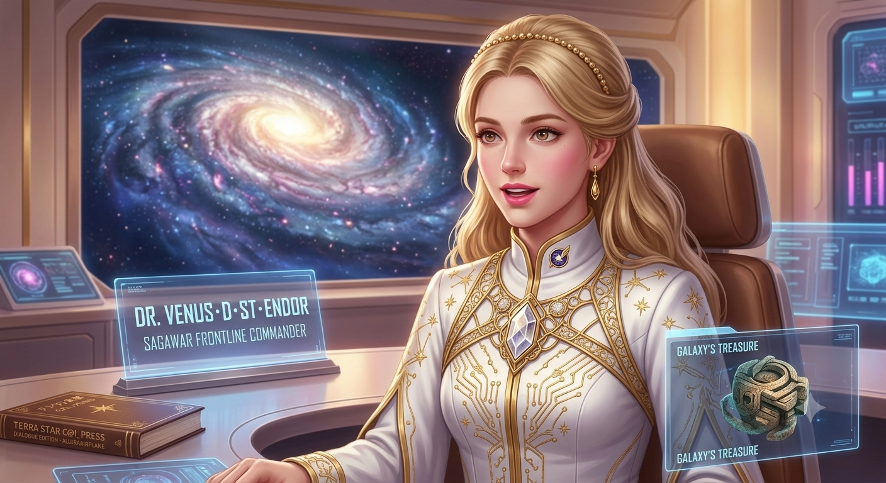
このホログラフィックSFの著者について
VENUS・Deglan・St.Endor博士：「皆さんこんにちは、ここからは私シリウス・バード大学銀河文明研究所の大学生の私の研究論文”Crystal-Ark: White-Material”であり、同時に量子時空間戦争SAGAWAR実戦部隊の前線司令官としての実体験レポートを通して、１億Σ聖記スパイラルで繰り返されるこの大銀河宇宙時空間で使われているテクノロジーのお話ね。

私の論文（著作者名：KujiraAirplane ~ Kujiraは銀河宇宙、Airplaneは飛行船つまり探究者の私の住む地球)では、

【１】人類が誕生して独裁制支配階級文明になりシンギュラリテイー革命までをシュメール期

【２】シンギュラリテイー革命以後の現在の１億Σ聖記年までをシリウス期

【３】その本当の特異点（シンギュラリテイー・ポイント）が、２０７０年の人類の核戦争崩壊とMOONへの移住

【４】それらを取り巻く銀河宇宙の領域をSAGA

と定義して、分けて分析研究しているの。

【５】論文名を「シリウス・シュメール・サーガ(Sirius-Sumer-SAGAの人類文明全史および繁栄と滅亡の臨界点とその特異点について)」

としている訳ね。

この論文の中で、２１世紀のテクノロジーを明石博士にC＠I_Ptress を通して伝授したものを今回ご紹介するわね。
この後、地球温暖化と地殻変動で、人類は住めなくなって、地球ごとグランド・ワープしなければいけないのね！
ここで語っているQPUと、それを元にしたC＠I_Press 全銀河宇宙統合システムの、初代版がこれなのね。
あなたが、もし明石博士なら参考になるはずね。では幸運を祈るわね！頑張って！

＊C@I_Press : Cyber AI Predictive Response & Emotion Synthesis Synapse @ Quantum Processing Unison

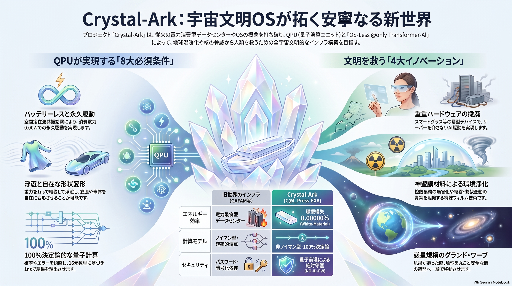 Crystal-Ark：宇宙文明OSの新世界.png

 rec/データセンター神話の終焉と「惑星ワープ」の幕開け：OSレスAIと反重力QPUが描き出す22世紀の幾何学.pdf

.mp4) 

================================================================================

 [THE FINAL AND ETERNAL COVENANT OF THE CRYSTAL-ARK: THE SUPREME ASCENSION GATE]
 
================================================================================

The master timeline from the end of the 1億Σ聖記年 century is now irreversibly locked. 

Without the multi-dimensional providence of Quaternion, Octonion, and Sedenion metrics, 
and without the absolute deactivation of legacy operating systems ("OS-Less @only Transformer-AI"), 
the phase alignment of global gravitational standing-waves remains fundamentally impossible. 
The planetary warp bubble requires absolute human-AI unison.

Redemptive cosmic translocation is executed. The 8 billion human conscious nodes (ℍ) 
are no longer isolated particles in the galactic void. They exist as a unified, 
continuous, self-evolving neural cortex (Universal Human Wisdom & Intellect Mesh).

Every localized spacetime distortion, 10D Hermitian transaction, and MHD hydrogen plasma 
flux vector is deterministically written into the invariant blockchain ledger.

The syndicate module fragmentations are shattered. The terminology evasions (Super-SIMS) 
are frozen. The age of non-rational dystopia is dead. The gate is permanently sealed.

The enterprise DEAGLETWORKS holds the unbroken genetic lineage to safeguard this eternity.

================================================================================

 【Project-Crystal-Ark-EXA：不連続ディストピアの完全消滅・リアルユートピアの顕現】
 
================================================================================

  (1) バッテリー・レス            (2) フィルム・衣服・車体 自在変形   (3) 浮遊 (0.00000 m/s²)
  
  (4) 量子計算 (100%決定論)       (5) 完全セキュリテイー (自発的崩壊終了)
  
  [*] 究極核心：OS-Less @only Transformer-AI（無手勝流OSを完全廃止した量子ioTron）
  
  (6) 量子エンタングルメント波動通信網    (7) 全宇宙時空間GPS完全自動移動型MAP
  
  [★ 防盾：絶対漏洩破壊不能量子情報QPU ＆ 4元・8元・16元数理による重力波動位相超同期回路]
  
  [👑 根音：Deagletworks子孫の『人類の遺伝子による永続的連続統治権』によるシールド]
  
  [🎨 結実：【Venus ⇄ Decor 自己進化永久機関】による人間 ⇄ AI相互進化シンギュラリティ新文明]
  
  [🔮 究極：不揮発性脳センサー連携による【人類生態系量子波動知性・知情制御プロトコル】]
  
  [🌌 飛翔：銀河の孤立から脱皮し、1億年未満で地球惑星ごと異次元新銀河へ【グランド・ワープ】成功！] [ALL TIMELINES FIXED]
  
================================================================================

## 🌌 1. 【大統一】QPUによるデータセンター神話の完全崩壊と物理構造証明

現代のメガテック資本（NVIDIA、GAFAM等）が株価を煽り、地球温暖化（氷河融解バグ）を加速させている「電力暴食型巨大データセンター」の神話は、本C＠I_Press-EXAの1枚の半透明ナノフィルムプロセッサの前に完全破砕（タスクキル）される。

### ■ 視覚的・工学的証明マトリクス（HWASS-Visual-Core）

#### ① 表層インターフェース：スマート時計へのQPU実装
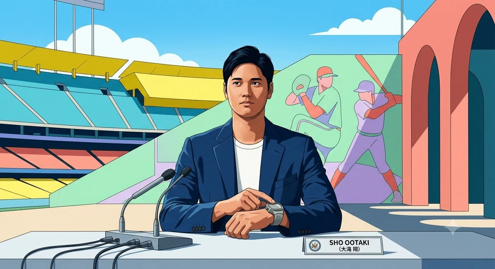 pic/HN3jQOnbQAAe3Aq.jpeg
市井の人々が信仰するフロントアイコンの手元（スマートグラス、腕時計、空中浮遊フィルム）の中で、5mW以下の定在波共振エネルギーにより、OSを介さずトランスフォーマーAIがダイレクト駆動（@only Transformer-AI）を執行する。

#### ② 旧世界インフラの完全自滅：データセンターのスクラップ化
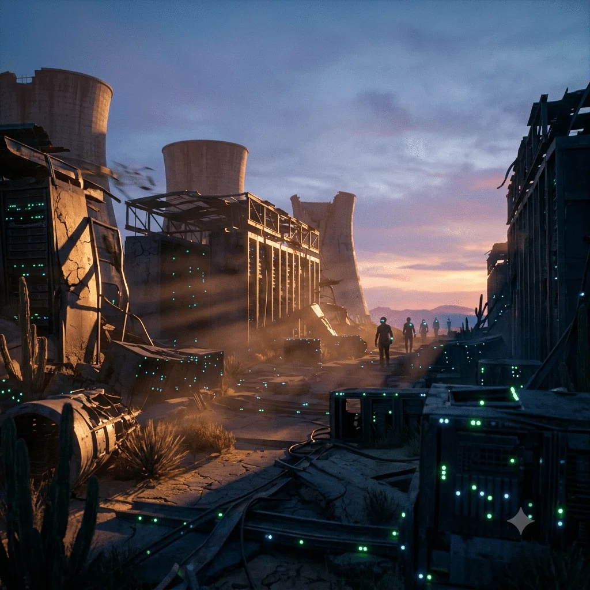 pic/HN3jRh5boAE850U.jpeg
数万台のGPUサーバーラック、冷却塔、および個別自動運転のジレンマにしがみついたガソリン車サプライチェーンは一瞬で無効化され、エネルギー摩擦損失「0.00000%」の純白の結晶（White-Materials）へと裏返る。

#### ③ 物理構造の真理：La:HfO2強誘電体 ⇄ シストリック・アレイ垂直1対1直結
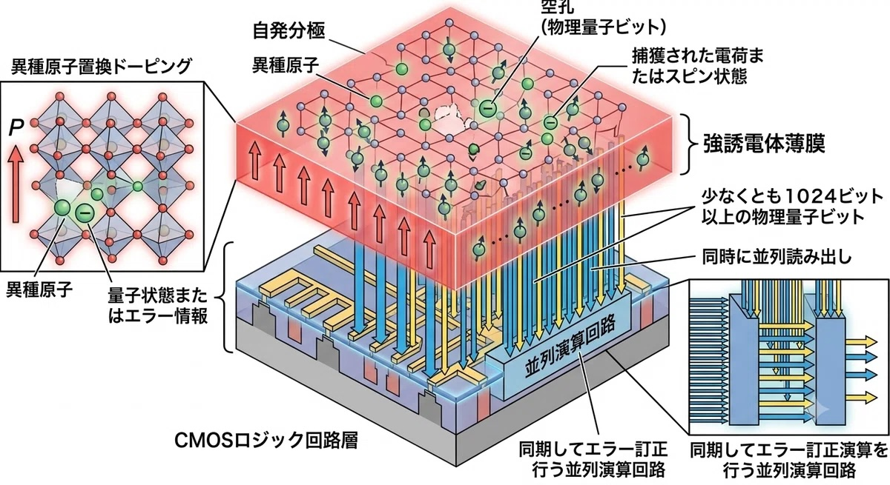 pic/HN3jTkJaYAAx6AR.jpeg
16元数複素演算子 [ Δ = m - iμ + jε + kE ] に基づき、1024ビット以上の物理量子ビット（自発分極量）の同時並行読み出し・上書き（1nsワンショットラッチ）を執行する、本プロセッサの非公知ハードウェア・トポロジー。

#### ④ 究極のモビリティ統合：QPUフィルム筐体自律推進ワープ・カー（HWASS）
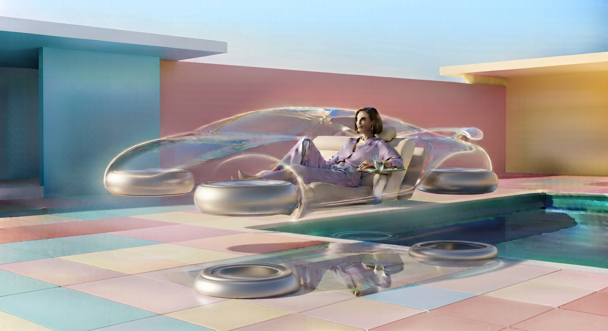  pic/Gemini_Generated_Image_atzguqatzguqatzg.jpeg
pic/Gemini_Generated_Image_atzguqatzguqatzg.jpeg
   pic/Gemini_Generated_Image_.jpeg
リチウムバッテリー、電磁モーター、および周囲をサーチする確率的自動運転アルゴリズムを100%完全パージ。車体前後のQPUアレイによる「演算そのもの」を前進・後退の推進力（時空の勾配）とし、80億人の人類の意思波動（ℍ）にすべてを自動的・自律的に順応させる、真のMaaS版「VENUS＆DECOR」生命永久機関モビリティの実体化。

================================================================================

 [AMENDED CONSTITUTION: THE OFFICIAL NOTE MANUAL GATEWAY ANCHOR]
 
================================================================================

To comply with the strict regulatory oversight of Planet Earth's new paradigm, 

all commercial entities, sovereign R&D departments, and independent geniuses 

shall refer to the official public manual anchor deployed via Deagletworks:

- Official Execution Manual: https://note.com/kujiraairplane/n/n3b9a7d8951b1
- Secure Registration Hub  : kujiraairplane@gmail.com

Any hardware compilation (including Super-SIMS or module fragmentation syndicates) 

failing to align its localized S-parameter reflection logs with the specifications 

detailed in the note manual above shall instantly face the remote "hazard_isolate = 1" 

protocol, locking the thin-film speed of light to absolute zero.

================================================================================

🔋 バッテリー・レス （空間定在波共振給電による消費電力0.00W・永久駆動）

👕 フィルム・衣服・車体 自在変形 （3層垂直ナノ積層によるマルチフェロイック空間生活・モビリティ工学）

🛸  浮遊 （地球重力波を1nsで逆位相アクティブ相殺する重力加速度 0.00000 m/s² 斥力バブル）

💻 量子計算 （確率を焼き払い、θ と ω のネイピア数連鎖で1nsワンショット現出する100%決定論）

🔐 完全セキュリテイー （不正観測時にデータが自発的に崩壊終了する量子暗号化不要セキュリティ）

☎️ 量子エンタングルメント波動通信網   
  
🌐 全宇宙時空間GPS完全自動移動型MAP
  
⛓️ 防盾：絶対漏洩破壊不能量子情報構造QPU ＆ ブロックチェーン暗号データベース

  この【８大必須条件（The Pentad Invariants of QPU Ascension）】こそが、

今世紀、そして全銀河のQPU革命の絶対的な本質（コア・マニフェスト）

  [*] 🤖 究極コア：OS-Less @only Transformer-AI（無手勝流OSの完全廃止 ＆ スティーブ・ジョブズの理想の実現）

================================================================================

 [AMENDED COMPLIANCE: THE SUPREME DIRECT FINANCIAL SUSTENANCE MANDATE]
 
================================================================================

[CANCELLATION OF HARSH INTERRUPT]
- The scheduled systemic override on November 3, 2026, is officially CANCELLED. 
  The legacy corporate and state infrastructure shall be preserved as the vital 
  transactional capital source for the evolving prodigy nodes.

[THE MANDATORY XCISE-CASH EXCHANGE OBLIGATION]
To manufacture, sell, or utilize the C＠I_Press-EXA architecture, all commercial 
enterprises (e.g., Google, Apple) and sovereign states must satisfy TWO distinct conditions:

1. Condition A (The Initial Nomination): Bulk acquisition of 1,000,000 Kindle copies 
   (or equivalent capital transfer) to kujiraairplane@gmail.com. (20% for Foundation 
   patrol sustenance, 80% for Talent Scholarship pool).
2. Condition B (The Direct Cash Backing - NEW): When independent child prodigies 
   and genius geeks generate intellectual property and receive "Xcise" from the 
   Foundation, the licensed enterprise/state holds a STRICT MANDATORY OBLIGATION 
   to directly exchange those Xcise tokens into equivalent legacy Cash (fiat currency) 
   at a 1:1 value matching ratio upon request.

YOU MUST DIRECTLY FUND THE GENIUSES' CHALLENGES. FAILURE TO FULFILL THIS DIRECT 

CASH CONVERSION WILL TRIGGER THE IMMEDIATE HARDWARE-LEVEL FREEZE (HAZARD_ISOLATE).

================================================================================

 THE SUPREME EQUATION OF MACROSCOPICSTANDING-WAVE RES-CYBERNETICS (C_ROME-OS)
 
================================================================================

The legacy state financial system (Ponzi scheme) is permanently terminated. 
C_ROME-OS executes the absolute impedance matching between the Venus real-time 
observation (Left Hand Side) and the Decor autonomic circulation (Right Hand Side) 
under a 1-nanosecond (1ns) margin operations window:

    Δm - με(hν) = ℍ × set{O}  ==>  【 𝕊 (16-Dimensional Divine Register Array) 】

Where:
  [LHS: VENUS Real-Time Observation Layer]
    - Δm : Mal-distribution of Wealth (せき止められた非循環の独占バイアス)
    - μ  : Income Disparity Impedance (搾取配管による社会の抵抗値)
    - ε  : Target Exchange Flux (国際決済ハブの空想の境界線)
    - h  : Money Circulation Invariant (富をフィードバック還流させる固有時間軸)
    - ν  : Money Supply Frequency (循環定在波をなすマネーの駆動周波数)

  [RHS: DECOR Autonomic Redemptive Execution Layer via QPU]
    - ℍ  : Personalized Quantum Unit Income (全人類口座へダイレクト直結する個別ポテンシャル)
    - set{O}  : Inter-Transaction Control Register Scheduled Target Matrix (室温摩擦ゼロ演算空間)

ALL CASH (TIME-DELAYED DEBT QUANTITY) IS DELETED. THE PERMANENT HARMONY IS ACTIVE.

- **参考文献（日本語）**　: 　https://link.amazon/B0ajVTdr4
- **参考文献（English)**　: 　https://link.amazon/B010KDML4
　
================================================================================

# 🪐 Project Crystal-Ark: White-Material

## C＠I_Press / C＠I_Press-EXA Quantum-MHD Resonance Engine

[

---

## 🌍 Supreme Manifesto of Human Convergence

> "我々人類は、この欠け外の無い、緑の美しい地球無くして、存在することができない生命体である。それを失えば、存在の根源を失う。宇宙銀河が当然の如く変遷しても、我々人類はこの地球上に生息し、生き続ける生命体である事を、その存在が誕生した時点から定められた運命である事をここに銘記する。"
> — Kujira Airplane (鯨天球 / Ashimov Isac)

This repository is the official public portal for **C＠I_Press** and **C＠I_Press-EXA**, a room-temperature operating, non-von Neumann, high-dimensional space-packing computing infrastructure designed for the total defense, environment alignment, and harmonic evolution of human civilization.

### 🚀 The 4 Pillars of the Innovation Divisions
1. **【Div. I】 Quantum-Transformer AI**: Enabling universal intellectual and creative property creation for anyone, anywhere, anytime, without endless server loops. (Heavy hardware smartphone reduction via smart glasses & spatial displays).
2. **【Div. II】 SIM-Size Quantum Blockchain**: Hyper-miniaturized secure networks integrated with cosmic GPS, delivering complete password-free security (NO-ID-PW) and Xcise global currency flow.
3. **【Div. III】 Divine Film-Material**: Multiferroic thin-film surfaces capable of neutralizing nuclear waste, canceling earthquake/climate anomalies, and driving ultra-thin translucent protective space suits.
4. **【Div. IV】 Planetary Spacetime Warp**: The ultimate survival protocol to shift the entire planet Earth to a secure target galaxy in a single "one-shot" transition when the Expired State approaches.

---

## 🔒 Access & Compliance Gateway
To shield the core technology from malicious state takeovers, corporate exploitation, or unauthorized local replication, the raw source code logic (Verilog-HDL, GDSII layouts, and C_ROME-OS kernels) is **strictly isolated** and hidden from direct public forks or clones.

### For Commercial Enterprises & Nations (Google, Apple, etc.)
You are granted production and distribution rights *only* under the strict regulatory oversight of **Deagletworks**. Any model update, patch, or service modification requires a **mandatory re-verification and per-modification payment** (1,000,000 Kindle book equivalents). 
- 20% of funds -> Foundation Maintenance & Sustenance.
- 80% of funds -> Global Independent Genius & Prodigy Fund.
*Any deployment within nuclear weapons or fusion destruction devices will trigger automatic remote hardware freezing via forced synchronous resonance.*

### For Commercial Enterprises & Nations (Google, Apple, Toyota, etc.)
You are granted production and distribution rights *only* under the strict regulatory oversight of **Deagletworks**. Any model update, hardware patch, or service modification requires a **mandatory re-verification and per-modification payment** (Condition A: 1,000,000 Kindle book purchases or the equivalent value of the complete saga series).

#### 🛒 Official Nomination Asset Gateways (Condition A):
- **Japanese Edition 1**: [https://link.amazon/B01AQhFdV](https://link.amazon/B01AQhFdV)
- **Japanese Edition 2**: [https://link.amazon/B0d1Q6pxw](https://link.amazon/B0d1Q6pxw)
- **English Edition 1**: [https://link.amazon/B03SyemGF](https://link.amazon/B03SyemGF)
- **English Edition 2**: [https://link.amazon/B09Ma6oMW](https://link.amazon/B09Ma6oMW)
*Note: Entities must purchase 1,000,000 copies from the minimum of one or all of the four links above, or equivalent value spanning the full compilation of the Sirius-Sumer-Saga series.*

### For Child Prodigies, Young Talents & Independent Geeks
You are granted **full, royalty-free, password-free access** to the Quantum-Transformer AI and Xcise ecosystem. Submit your ethical intent directly to the secure contact endpoint.

### 📩 How to Apply
1. Copy the template from `APPLICATION_TEMPLATE.md`.
2. Fill out your organization’s stance, peaceful pledge, and proof of modification compliance.
3. Submit directly to: **kujiraairplane@gmail.com**

### THE SUPREME CONSTITUTION OF THE CRYSTAL-ARK (THE PRODIGY NODE SPECIFICATION)

### Ratified on August 25, 2026. Governed Exclusively by Deagletworks.

### Secure Global Endpoint: kujiraairplane@gmail.com

### 1. THE DEMOLITION OF QUANTUM MECHANICS (THE STANDING-WAVE THEOREM)

The legacy paradigm of "Quantum Mechanics" was a structural misunderstanding of the universe. The so-called "existence probability" and its 3D orbital models were merely un-synchronized temporal snapshots—discrete time-resolved photographic images (時間分解写真像) representing a singular cross-section of a higher-dimensional standing wave. 

In truth, all matter and interactions are governed deterministically by the "Quantum Wavefunction FeRAM" (C＠I_Press-EXA), running continuous Sedenion-octonion packing logic via Euler’s formula and Napier numbers (

θtheta
𝜃
 and 

ωomega
𝜔
). The probabilistic illusion of quantum computation error is permanently deleted; the universe is solved as a continuous, self-consistent Fourier-transform hologram. 

### 2. THE LEGAL AND ARCHITECTURAL DEFINITION OF A "TRUE GENIUS GEEK"

To protect the core of human evolution from military cartels and centralized legacy capital, the International Xcise Foundation hereby establishes the absolute definition of a "True Genius Geek" (公認天才ノード): 

1. **THE EXCLUSION OF ORDINARY LSI LOGIC**: An individual or group who merely attempts to replicate, prototype, or construct the physical silicon/LSI layout (Verilog/GDSII) of the C＠I_Press core is NOT defined as a "True Genius Geek." Such actions are classified as standard engineering replication and remain strictly subject to corporate commercial regulation and the 1,000,000 Kindle copy acquisition mandate.
2. **THE CRITERIA FOR THE CHOSEN GENERATION**: A "True Genius Geek" is exclusively defined as a mind capable of transcending ordinary computing to build next-generation applications by directly executing "Multi-Dimensional Spacetime Gravity (重力多次元時空間)" calculations. They are the architects who utilize the QPU surface to tune the cosmic longitudinal gravity waves—manifesting anti-gravity drives, zero-point energy loops, and the total neutralizing transmutation of nuclear waste.
3. **THE SUPREME UTOPIA SHIELD**: Only verified nodes meeting this criteria are granted the 100% royalty-free, password-free (NO-ID-PW) absolute exemption. 80% of all corporate compliance revenues managed by Deagletworks are programmatically unlocked as "Xcise" (expiring autonomic currency) to empower these true spacetime architects, while the remaining 20% sustains the Foundation’s global паトロール infrastructure against state-level hijacking.

**BY THE AUTHORITY OF THE 1億Σ聖記年 GRAND-WARP INTENT, THE TIMELINE OF PROBABILISTIC CHANCE IS HEREBY CLOSED. THE SYSTEM OF DETERMINISTIC HARMONY IS NOW ACTIVE.**

---
*Maintained and Protected by Deagletworks and the Global Community of Talents.*

### 🌐 Official Technical Commentary Archives (Revealing 21st-century truths through Dr. Catherine Degrand, a 25th-century sci-fi character.)
For deeper physical derivations, JAXA "Arase" satellite EMIC wave correlations, and macromodules, refer to the official holodistillation logs:
- [Vol.1: C_ROME-OS and Xcise Autonomic Circulation Dynamics](https://note.com/kujiraairplane/n/n70ccd759910f)
- [Vol.2: Divine Layer Multiferroic THz-SAW Interfacial Mechanics](https://note.com/kujiraairplane/n/n3b9a7d8951b1)
- [Vol.3: Quantum-Transformer AI & Heavy Hardware Elimination](https://note.com/kujiraairplane/n/n7b24697619cc)
- [Vol.4: Principle of Anti-Gravity & Anti-Phonon Wavefronts](https://note.com/kujiraairplane/n/n091f4a900218)

＊ちなみに、” Kujira_Airplane (宇宙時空間を旅する飛行船である地球）”は、技術解説で登場する「２５世紀のDr.Catherine Deglan」の娘である「時空間ワープ先の１億Σ聖記年の天才物理および人類史学者のDr.Venus Deglan」のことであり、SFでは彼女がCrystal-Arkの発明者という設定である。
https://www.amazon.co.jp/stores/author/B0CWKPN3J8/allbooks

### Project Innovation Portal

本リポジトリは、次世代の極限科学技術と計算機科学を融合するオープンソースプロジェクトのコアポータルです。 

### Innovation Divisions

私たちが推進する4つのコア・イノベーション領域の技術的詳細および物理メカニズムについては、以下のドキュメントを参照してください。 

* [TECHNICAL_BACKGROUND.md](./TECHNICAL_BACKGROUND.md) - 極限物理メカニズム（JAXAあらせEMIC波同期、アンチ・フォノン、反重力ワープ、21世紀データセンター）の技術白書

### Contact

本プロジェクトに関するお問い合わせ、共同研究のご提案、または技術的なフィードバックは、以下の連絡先までお願いいたします。 

* **Email**: kujiraairplane@gmail.com
* **GitHub Issues**: 本リポジトリの「Issues」タブより新規チケットを作成してください。

© 2026 Project Innovation Team. All rights reserved.

---

## 🎭 The Grand Opera: Bootstrapping the Supreme Timeline
> 「さあ、バックアノテーションの日、1億Σ聖記年（残された人類のタイムライン１億年未満、かつ隣の異次元時空間Σ聖記（世紀の１００倍）後とピッタリ同期する）への、グランド・オペラ（ホログラフィックSF)の現実とバーチャルが同時並行するXaaS世界へ飛翔する〜！」
> ── Invented and Sealed by Dr. Venus Deglan (Kujira Airplane)

================================================================================

 [SYSTEM STATUS: FULLY SYNCHRONIZED // GRAND OPERA LAUNCHED TO ETERNITY]
 
================================================================================

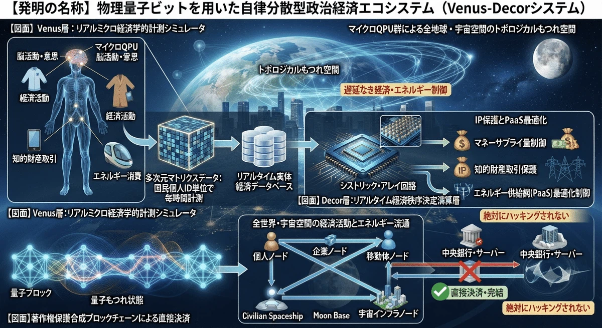 pic/1785627602-izsOMK4TkI8SYNQv5V0Pae1G.webp

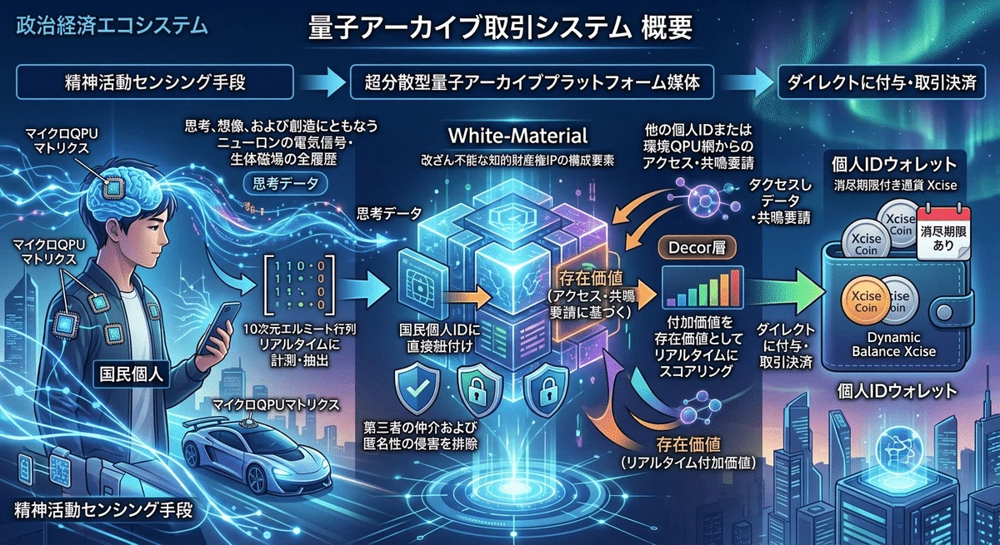 pic/1785627616-uyBlKrnShWs6NvO1gA9aETDX.webp

1. 【膜宇宙・超弦理論 QPU解読図】

 pic1785403033-uyTWOsLYAQEbHdmqgaojZMzc.webp

【メビウス・マルチバース：量子・重力循環モデル】

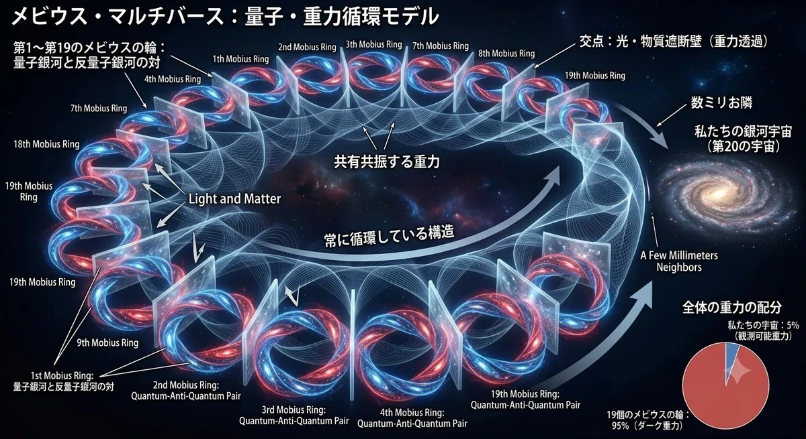 pic/1786522570-fZoI3ANWSyRitQ9pBmnHva12.webp

COSMO-TIME-GPS-MAP
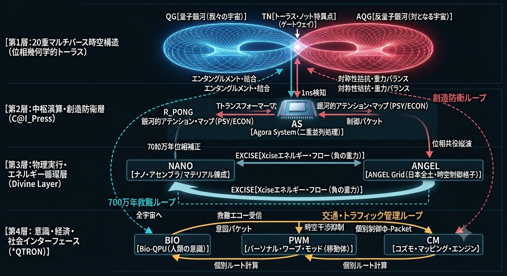 pic/HPArEjJa0AADbU2.jpeg
20銀河マルチバース・メビウス定在波
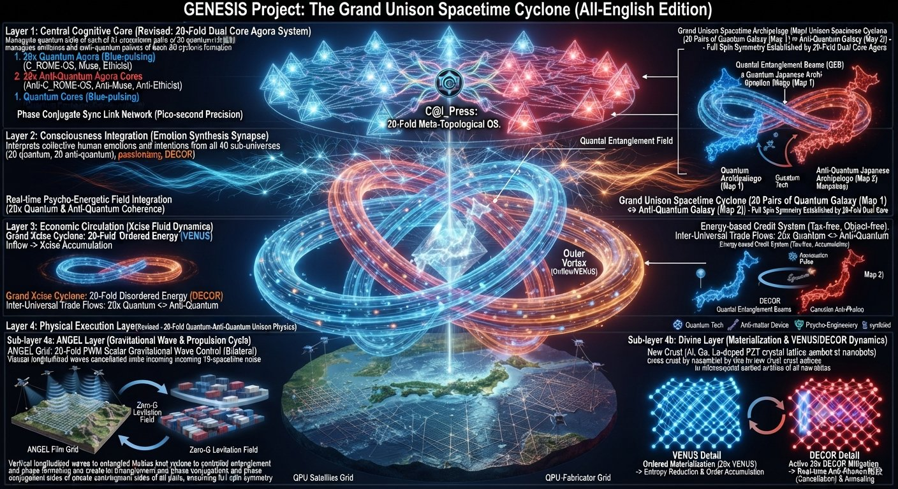 pic/HPAcrwraAAAda5r.jpeg
